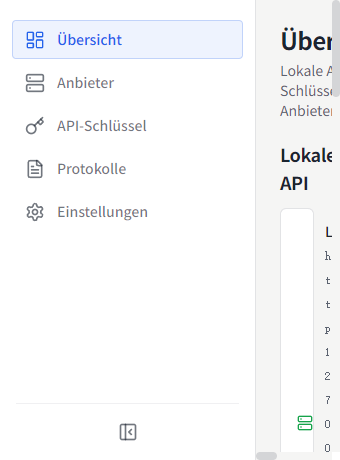
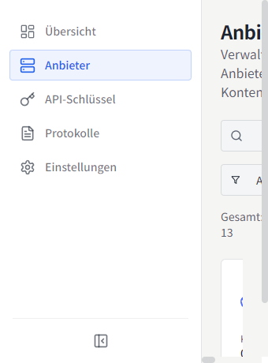
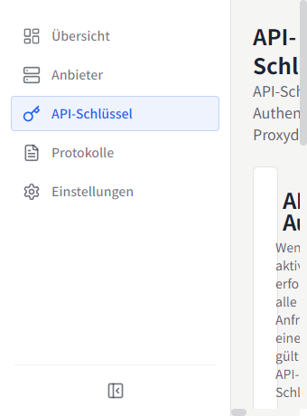
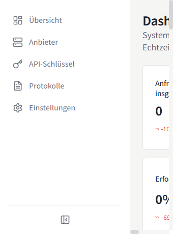
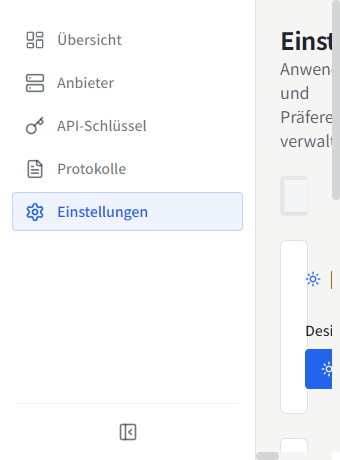

# MyChatBridge

<p align="center">
  
</p>

<p align="center">
  
  
  <br>
  <a href="https://www.electronjs.org/"></a>
  <a href="https://react.dev/"></a>
  <a href="https://www.typescriptlang.org/"></a>
  
</p>

[English](README.md) | [简体中文](README.zh-CN.md) | [繁體中文](README.zh-TW.md) | [日本語](README.ja-JP.md) | [한국어](README.ko-KR.md) | [Español](README.es-ES.md) | [Français](README.fr-FR.md) | **Deutsch** | [Русский](README.ru-RU.md)

MyChatBridge ist eine plattformübergreifende Desktop-Anwendung (Electron), die einen einheitlich verwalteten, OpenAI-kompatiblen API-Proxy für mehrere KI-Anbieter bereitstellt. Sie funktioniert sofort mit jedem OpenAI-kompatiblen Client wie Cline, Roo-Code oder Cherry Studio.

## ✨ Funktionen

- **OpenAI-kompatible API**: ein Standard-Endpunkt, der sich nahtlos in bestehende Tools integrieren lässt
- **Multi-Provider-Unterstützung**: DeepSeek, GLM, Kimi, MiniMax, Perplexity, Qwen, Z.ai, ChatGPT Web, Doubao Web und mehr
- **Web-LLM-Konten**: drei Authentifizierungswege — verwalteter Connect-Login, Browser-Cookie-Import (Windows) oder manuelles Token
- **Kontextverwaltung**: gleitendes Fenster, Token-Limits und Zusammenfassungsstrategien
- **Tool-Calling**: universelle Tool-Calling-Fähigkeit für alle Modelle durch Prompt-Engineering
- **Modell-Mapping**: Wildcard-Modellnamen-Mapping mit Routing über bevorzugten Provider/Account
- **Benutzerdefinierte Parameter**: benutzerdefinierte HTTP-Header zur Aktivierung von Websuche, Denkmodus und Deep Research
- **Dashboard**: Echtzeit-Anfrageverkehr, Token-Verbrauch und Erfolgsquote
- **API-Key-Verwaltung**: Schlüssel für den lokalen Proxy generieren und verwalten
- **Modellverwaltung**: alle verfügbaren Modelle pro Provider einsehen und verwalten
- **Anfrage-Logs**: detaillierte Protokolle für Debugging und Analyse
- **Proxy-Konfiguration**: flexible Proxy-Einstellungen und Routing-Richtlinien
- **System-Tray**: schneller Statuszugriff über die Menüleiste
- **9 UI-Sprachen**: 简体中文, English, 繁體中文, 日本語, 한국어, Español, Français, Deutsch, Русский
- **Operations-orientierte Oberfläche**: Informationsdichte zuerst, monospaced Ziffern, flaches Design

## 📸 Screenshots

### Übersicht


### Provider


### API-Schlüssel


### Dashboard


### Einstellungen


Weitere Screenshots in anderen Sprachen finden Sie unter [`docs/screenshots/`](docs/screenshots).

## 📥 Installation

### Download

Die neueste Version gibt es auf [GitHub Releases](https://github.com/shellxuatgit/mychatbridge/releases):

- Windows: `nsis`-Installer
- macOS: `dmg` / `zip`
- Linux: `AppImage` / `deb`

### Aus dem Quellcode bauen

```bash
git clone https://github.com/shellxuatgit/mychatbridge.git
cd mychatbridge
npm install
npm run build:win    # Windows
npm run build:mac    # macOS
npm run build:linux  # Linux
```

## 🚀 Verwendung

1. **App starten** — sie läuft im Hintergrund mit einem Symbol im System-Tray.
2. **Provider hinzufügen** — gehen Sie zu *Provider*, wählen Sie einen Anbieter und verbinden Sie ein Konto:
   - **Connect (empfohlen)**: ein verwaltetes Chromium-Fenster öffnet die offizielle Web-UI des Anbieters; melden Sie sich normal an, und die Sitzung wird dauerhaft gespeichert.
   - **Aus Browser importieren (Windows)**: vorhandene Anmeldung aus Chrome/Edge wiederverwenden, ohne Browserdaten zu verändern.
   - **Manuelles Token**: vorhandenes Access-Token einfügen.
3. **API-Schlüssel erstellen** — gehen Sie zu *API-Schlüssel* und generieren Sie einen Schlüssel für den lokalen Proxy.
4. **Client auf den Proxy verweisen** — verwenden Sie `http://localhost:<port>/v1` mit dem API-Schlüssel in Cline / Roo-Code / Cherry Studio und wählen Sie einen beliebigen gemappten Modellnamen (z. B. `gpt-4o`, `claude-3-5-sonnet`).
5. **Überwachen** — Übersicht/Dashboard zeigt Live-Traffic, Token-Verbrauch und Protokolle.

> Das Tool-Calling-Protokoll-Tag seit v0.1.0 ist `<|MYCHATBRIDGE|tool_calls>`. Bitte aktualisieren Sie Ihre Client-Integrationen entsprechend.

## ⚙️ Konfiguration

Alle Daten werden unter `~/.mychatbridge/` gespeichert:

| Datei / Ordner | Zweck |
| --- | --- |
| `data.json` | Anwendungskonfiguration, Provider, Konten |
| `logs/` | Anfrage-Protokolle |
| `web-runtime/` | Verwaltete Browser-Profile für Web-LLM-Sitzungen |

Die Anzeigesprache kann jederzeit über die Kopfzeile oder *Einstellungen → Darstellung* geändert werden.

## 📄 Lizenz

[GPL-3.0](LICENSE)
