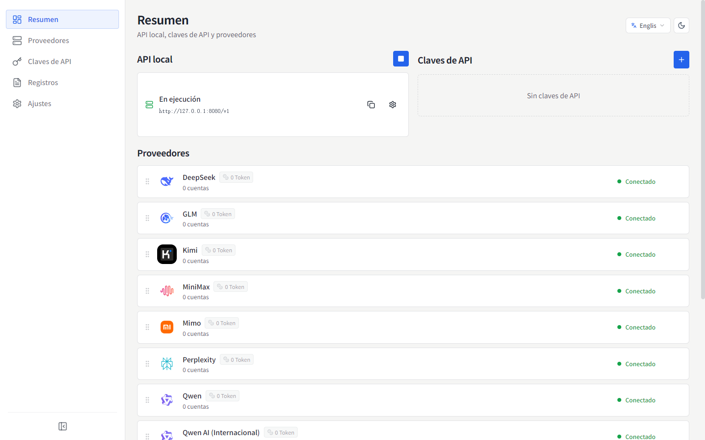
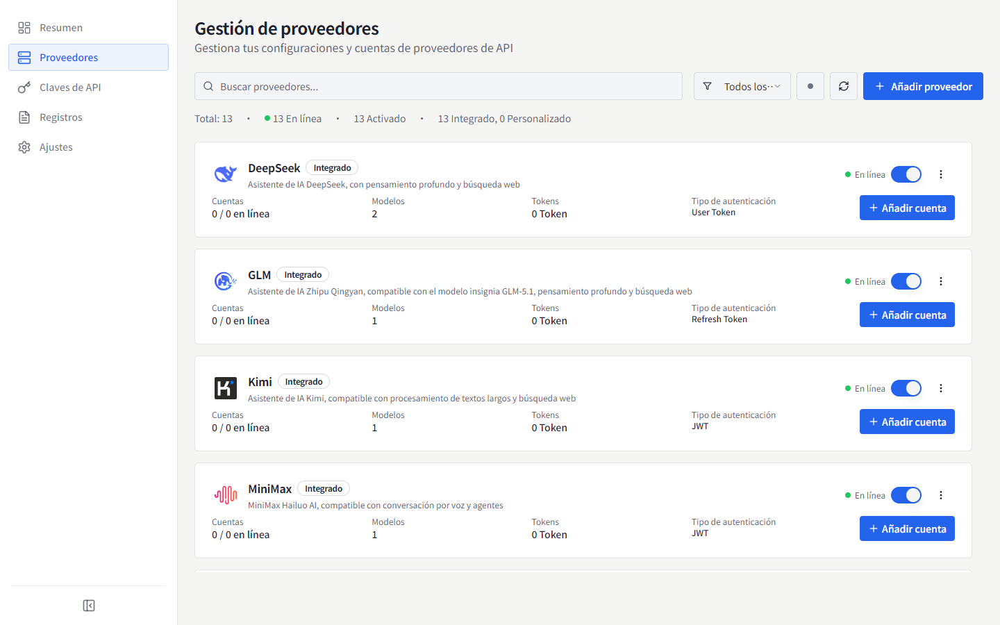
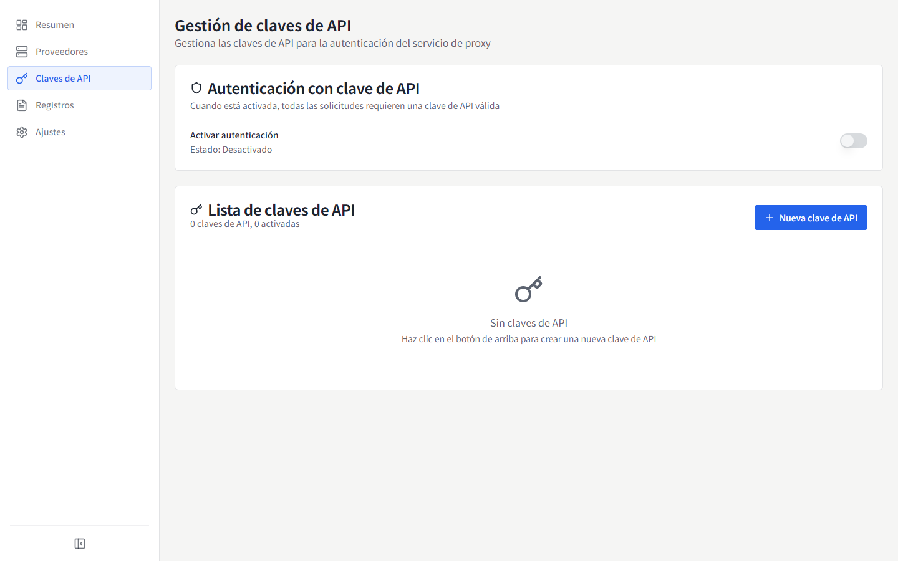
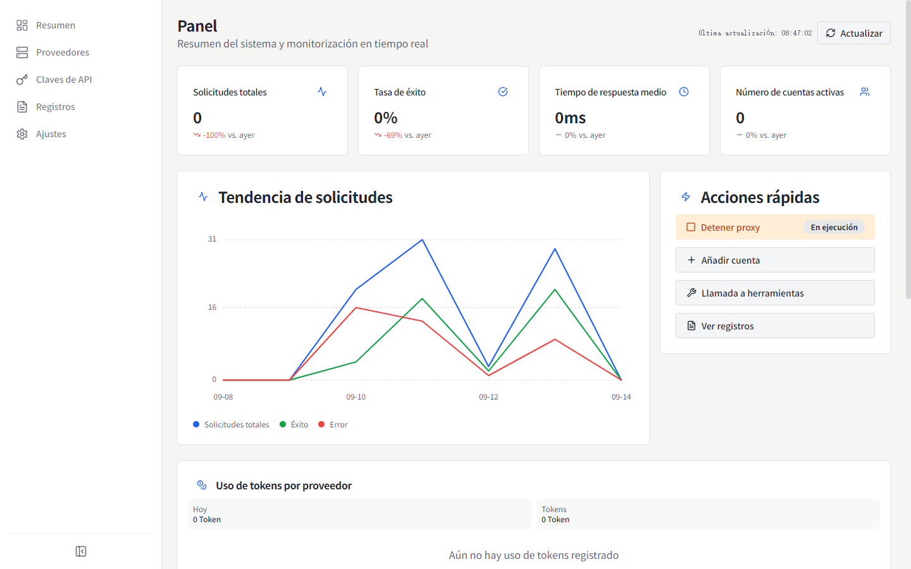
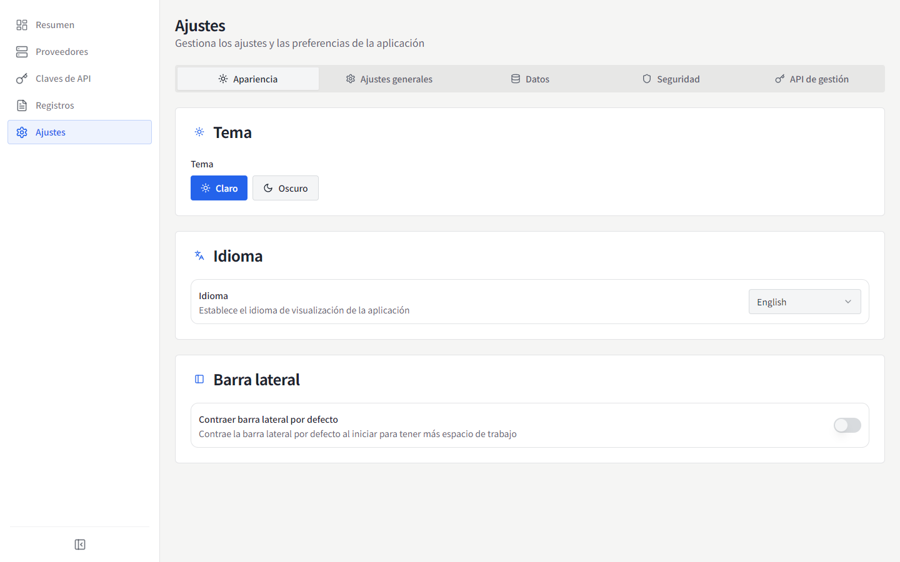

# MyChatBridge

<p align="center">
  
</p>

<p align="center">
  
  
  <br>
  <a href="https://www.electronjs.org/"></a>
  <a href="https://react.dev/"></a>
  <a href="https://www.typescriptlang.org/"></a>
  
</p>

[English](README.md) | [简体中文](README.zh-CN.md) | [繁體中文](README.zh-TW.md) | [日本語](README.ja-JP.md) | [한국어](README.ko-KR.md) | **Español** | [Français](README.fr-FR.md) | [Deutsch](README.de-DE.md) | [Русский](README.ru-RU.md)

MyChatBridge es una aplicación de escritorio multiplataforma (Electron) que proporciona un proxy de API compatible con OpenAI y gestionado de forma unificada para varios proveedores de IA. Funciona de inmediato con cualquier cliente compatible con OpenAI, como Cline, Roo-Code o Cherry Studio.

## ✨ Características

- **API compatible con OpenAI**: punto de conexión estándar que se integra a la perfección con las herramientas existentes
- **Soporte multi-proveedor**: DeepSeek, GLM, Kimi, MiniMax, Perplexity, Qwen, Z.ai, ChatGPT Web, Doubao Web y más
- **Cuentas Web LLM**: tres rutas de autenticación: inicio de sesión Connect gestionado, importación de cookies del navegador (Windows) o token manual
- **Gestión de contexto**: ventana deslizante, límites de tokens y estrategias de resumen
- **Llamadas a herramientas**: capacidad universal de tool calling para todos los modelos mediante ingeniería de prompts
- **Mapeo de modelos**: mapeo de nombres de modelos con comodines y enrutamiento por proveedor/cuenta preferido
- **Parámetros personalizados**: cabeceras HTTP personalizadas para habilitar búsqueda web, modo de razonamiento e investigación profunda
- **Panel de control**: tráfico de solicitudes, uso de tokens y tasa de éxito en tiempo real
- **Gestión de claves API**: generación y gestión de claves para el proxy local
- **Gestión de modelos**: consulta y gestión de todos los modelos disponibles por proveedor
- **Registros de solicitudes**: registros detallados para depuración y análisis
- **Configuración de proxy**: ajustes flexibles de proxy y políticas de enrutamiento
- **Bandeja del sistema**: acceso rápido al estado desde la barra de menús
- **9 idiomas de interfaz**: 简体中文, English, 繁體中文, 日本語, 한국어, Español, Français, Deutsch, Русский
- **Interfaz de operaciones**: densidad de información primero, números monoespaciados, diseño plano

## 📸 Capturas de pantalla

### Vista general


### Proveedores


### Claves API


### Panel de control


### Ajustes


Más capturas de pantalla en otros idiomas están disponibles en [`docs/screenshots/`](docs/screenshots).

## 📥 Descargas e instalación

### Binarios precompilados (v0.1.0)

| Plataforma | Enlace de descarga | Notas |
| :--- | :--- | :--- |
| **Windows** | [Descargar Instalador (.exe)](https://github.com/shellxuatgit/mychatbridge/releases/download/v0.1.0/MyChatBridge-0.1.0-x64-setup.exe) <br> [Descargar Portable (.exe)](https://github.com/shellxuatgit/mychatbridge/releases/download/v0.1.0/MyChatBridge-0.1.0-x64-portable.exe) | Windows 10/11 64 bits |
| **macOS** | [Descargar (.dmg)](https://github.com/shellxuatgit/mychatbridge/releases/download/v0.1.0/MyChatBridge-0.1.0-mac-universal.dmg) <br> [Descargar (.zip)](https://github.com/shellxuatgit/mychatbridge/releases/download/v0.1.0/MyChatBridge-0.1.0-mac-universal.zip) | Apple Silicon e Intel |
| **Linux** | [Descargar (.AppImage)](https://github.com/shellxuatgit/mychatbridge/releases/download/v0.1.0/MyChatBridge-0.1.0-x64.AppImage) <br> [Descargar (.deb)](https://github.com/shellxuatgit/mychatbridge/releases/download/v0.1.0/MyChatBridge-0.1.0-amd64.deb) | Ubuntu / Debian / Fedora |

Consulta todos los artefactos y versiones en [GitHub Releases](https://github.com/shellxuatgit/mychatbridge/releases).

### Compilar desde el código fuente

```bash
git clone https://github.com/shellxuatgit/mychatbridge.git
cd mychatbridge
npm install
npm run build:win    # Windows
npm run build:mac    # macOS
npm run build:linux  # Linux
```

## 🚀 Uso

1. **Inicia la aplicación**: se ejecuta en segundo plano con un icono en la bandeja del sistema.
2. **Añade un proveedor**: ve a *Proveedores*, elige un proveedor y conecta una cuenta:
   - **Connect (recomendado)**: se abre una ventana Chromium gestionada con la Web UI oficial del proveedor; inicia sesión con normalidad y la sesión se guarda de forma persistente.
   - **Importar del navegador (Windows)**: reutiliza un inicio de sesión existente de Chrome/Edge sin modificar los datos del navegador.
   - **Token manual**: pega un token de acceso existente.
3. **Crea una clave API**: ve a *Claves API* y genera una clave para el proxy local.
4. **Apunta tu cliente al proxy**: usa `http://localhost:<puerto>/v1` con la clave API en Cline / Roo-Code / Cherry Studio, y elige cualquier nombre de modelo mapeado (por ejemplo, `gpt-4o`, `claude-3-5-sonnet`).
5. **Monitorea**: la vista general/dashboard muestra tráfico en vivo, uso de tokens y registros.

> La etiqueta del protocolo de tool calling desde v0.1.0 es `<|MYCHATBRIDGE|tool_calls>`. Actualiza tus integraciones de cliente según corresponda.

## ⚙️ Configuración

Todos los datos se almacenan en `~/.mychatbridge/`:

| Archivo / carpeta | Propósito |
| --- | --- |
| `data.json` | Configuración de la aplicación, proveedores y cuentas |
| `logs/` | Registros de solicitudes |
| `web-runtime/` | Perfiles de navegador gestionados para sesiones Web LLM |

El idioma de la interfaz se puede cambiar en cualquier momento desde la cabecera o *Ajustes → Apariencia*.

## 📄 Licencia

[GPL-3.0](LICENSE)
