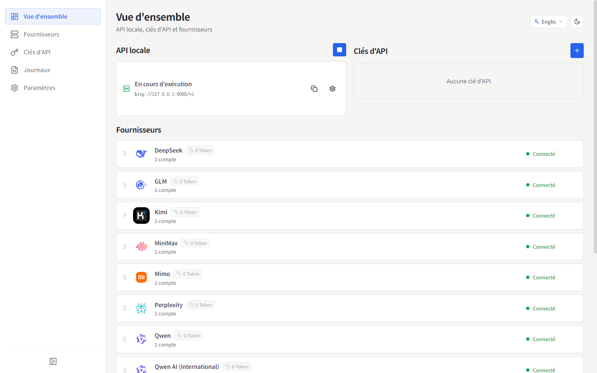
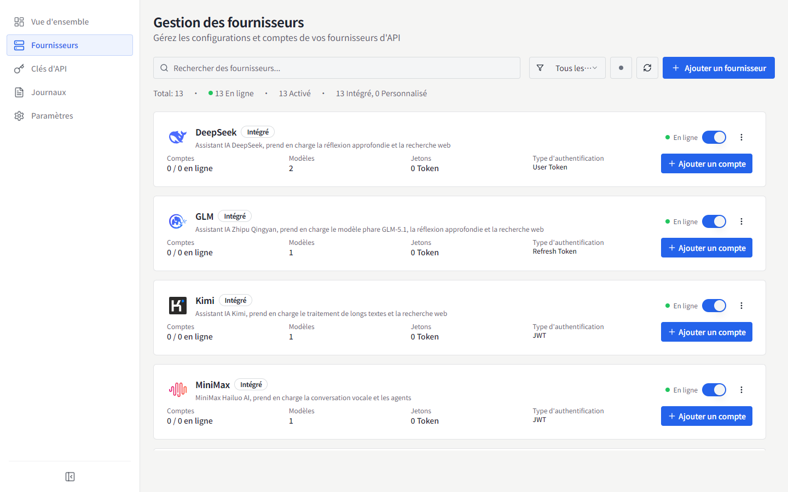
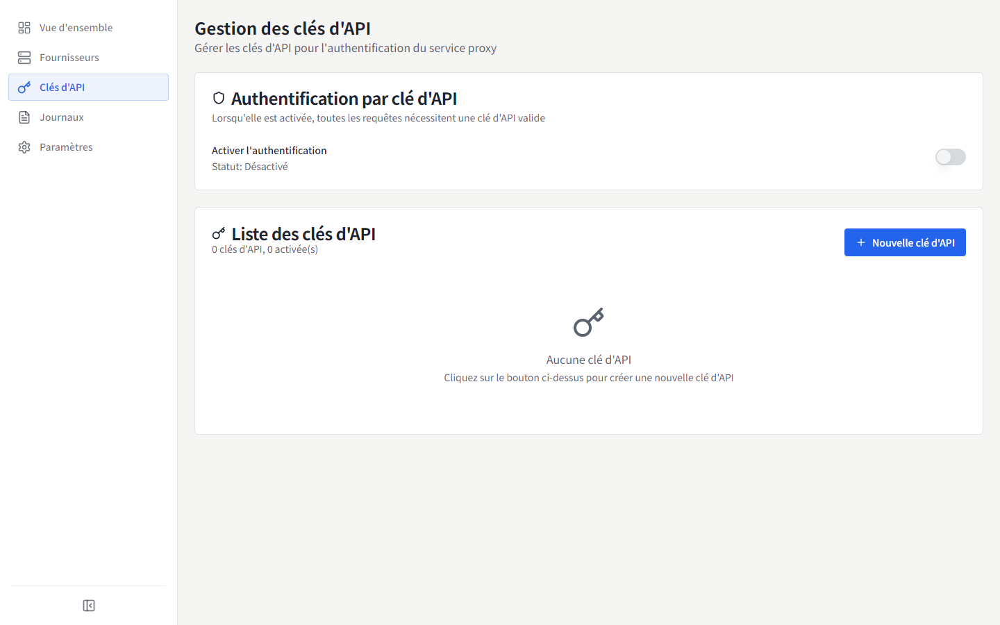
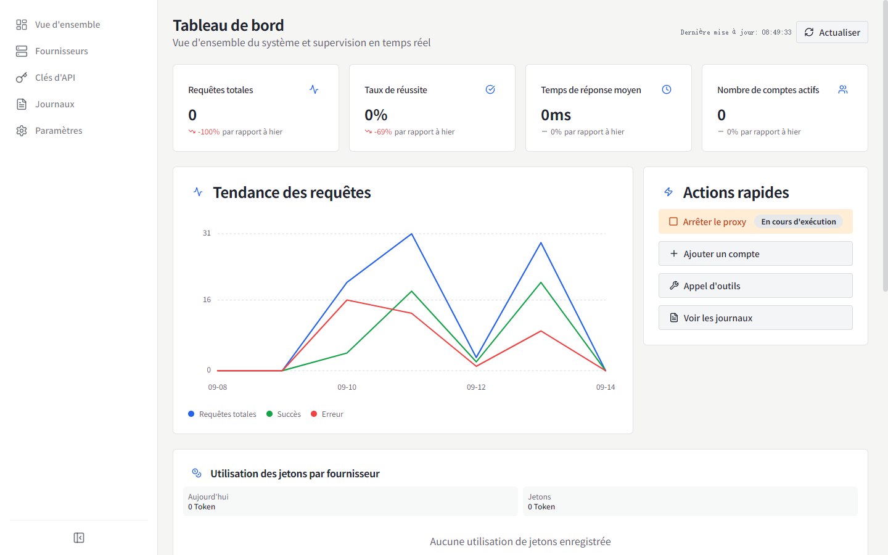
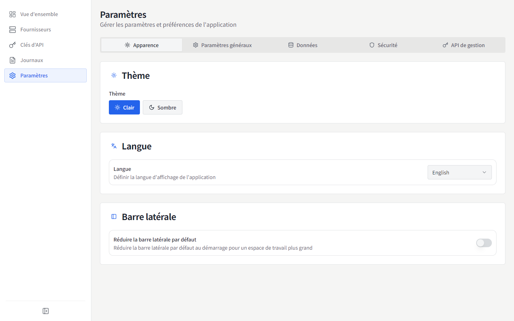

# MyChatBridge

<p align="center">
  
</p>

<p align="center">
  
  
  <br>
  <a href="https://www.electronjs.org/"></a>
  <a href="https://react.dev/"></a>
  <a href="https://www.typescriptlang.org/"></a>
  
</p>

[English](README.md) | [简体中文](README.zh-CN.md) | [繁體中文](README.zh-TW.md) | [日本語](README.ja-JP.md) | [한국어](README.ko-KR.md) | [Español](README.es-ES.md) | **Français** | [Deutsch](README.de-DE.md) | [Русский](README.ru-RU.md)

MyChatBridge est une application de bureau multiplateforme (Electron) qui fournit un proxy d'API compatible OpenAI et géré de manière unifiée pour plusieurs fournisseurs d'IA. Elle fonctionne directement avec tout client compatible OpenAI tel que Cline, Roo-Code ou Cherry Studio.

## ✨ Fonctionnalités

- **API compatible OpenAI** : un point de terminaison standard qui s'intègre parfaitement aux outils existants
- **Prise en charge multi-fournisseurs** : DeepSeek, GLM, Kimi, MiniMax, Perplexity, Qwen, Z.ai, ChatGPT Web, Doubao Web, etc.
- **Comptes Web LLM** : trois méthodes d'authentification — connexion Connect gérée, importation de cookies du navigateur (Windows) ou jeton manuel
- **Gestion du contexte** : fenêtre glissante, limites de jetons et stratégies de résumé
- **Appels d'outils** : capacité d'appel d'outils universelle pour tous les modèles via l'ingénierie de prompts
- **Mappage de modèles** : mappage de noms de modèles avec caractères génériques et routage par fournisseur/compte préféré
- **Paramètres personnalisés** : en-têtes HTTP personnalisés pour activer la recherche web, le mode réflexion et la recherche approfondie
- **Tableau de bord** : trafic de requêtes, utilisation des jetons et taux de réussite en temps réel
- **Gestion des clés API** : génération et gestion des clés pour le proxy local
- **Gestion des modèles** : consultation et gestion de tous les modèles disponibles par fournisseur
- **Journaux de requêtes** : journaux détaillés pour le débogage et l'analyse
- **Configuration du proxy** : paramètres de proxy flexibles et politiques de routage
- **Barre d'état système** : accès rapide à l'état depuis la barre de menus
- **9 langues d'interface** : 简体中文, English, 繁體中文, 日本語, 한국어, Español, Français, Deutsch, Русский
- **Interface d'exploitation** : densité d'information prioritaire, chiffres à chasse fixe, design plat

## 📸 Captures d'écran

### Vue d'ensemble


### Fournisseurs


### Clés API


### Tableau de bord


### Paramètres


D'autres captures d'écran dans différentes langues sont disponibles dans [`docs/screenshots/`](docs/screenshots).

## 📥 Téléchargements et installation

### Fichiers binaires précompilés (v0.1.0)

| Plateforme | Lien de téléchargement | Remarques |
| :--- | :--- | :--- |
| **Windows** | [Télécharger Installateur (.exe)](https://github.com/shellxuatgit/mychatbridge/releases/download/v0.1.0/MyChatBridge-0.1.0-x64-setup.exe) <br> [Télécharger Portable (.exe)](https://github.com/shellxuatgit/mychatbridge/releases/download/v0.1.0/MyChatBridge-0.1.0-x64-portable.exe) | Windows 10/11 64 bits |
| **macOS** | [Télécharger (.dmg)](https://github.com/shellxuatgit/mychatbridge/releases/download/v0.1.0/MyChatBridge-0.1.0-mac-universal.dmg) <br> [Télécharger (.zip)](https://github.com/shellxuatgit/mychatbridge/releases/download/v0.1.0/MyChatBridge-0.1.0-mac-universal.zip) | Apple Silicon et Intel |
| **Linux** | [Télécharger (.AppImage)](https://github.com/shellxuatgit/mychatbridge/releases/download/v0.1.0/MyChatBridge-0.1.0-x64.AppImage) <br> [Télécharger (.deb)](https://github.com/shellxuatgit/mychatbridge/releases/download/v0.1.0/MyChatBridge-0.1.0-amd64.deb) | Ubuntu / Debian / Fedora |

Consultez tous les fichiers et versions sur [GitHub Releases](https://github.com/shellxuatgit/mychatbridge/releases).

### Compilation depuis les sources

```bash
git clone https://github.com/shellxuatgit/mychatbridge.git
cd mychatbridge
npm install
npm run build:win    # Windows
npm run build:mac    # macOS
npm run build:linux  # Linux
```

## 🚀 Utilisation

1. **Lancez l'application** : elle s'exécute en arrière-plan avec une icône dans la barre d'état système.
2. **Ajoutez un fournisseur** : allez dans *Fournisseurs*, choisissez un fournisseur et connectez un compte :
   - **Connect (recommandé)** : une fenêtre Chromium gérée ouvre la Web UI officielle du fournisseur ; connectez-vous normalement et la session est conservée de manière persistante.
   - **Importer depuis le navigateur (Windows)** : réutilisez une session existante de Chrome/Edge sans modifier les données du navigateur.
   - **Jeton manuel** : collez un jeton d'accès existant.
3. **Créez une clé API** : allez dans *Clés API* et générez une clé pour le proxy local.
4. **Pointez votre client vers le proxy** : utilisez `http://localhost:<port>/v1` avec la clé API dans Cline / Roo-Code / Cherry Studio, puis choisissez n'importe quel nom de modèle mappé (par exemple `gpt-4o`, `claude-3-5-sonnet`).
5. **Surveillez** : la vue d'ensemble / le tableau de bord affiche le trafic en direct, l'utilisation des jetons et les journaux.

> L'étiquette du protocole d'appel d'outils depuis v0.1.0 est `<|MYCHATBRIDGE|tool_calls>`. Mettez à jour vos intégrations client en conséquence.

## ⚙️ Configuration

Toutes les données sont stockées sous `~/.mychatbridge/` :

| Fichier / dossier | Objectif |
| --- | --- |
| `data.json` | Configuration de l'application, fournisseurs, comptes |
| `logs/` | Journaux de requêtes |
| `web-runtime/` | Profils de navigateur gérés pour les sessions Web LLM |

La langue d'affichage peut être modifiée à tout moment depuis l'en-tête ou *Paramètres → Apparence*.

## 📄 Licence

[GPL-3.0](LICENSE)
