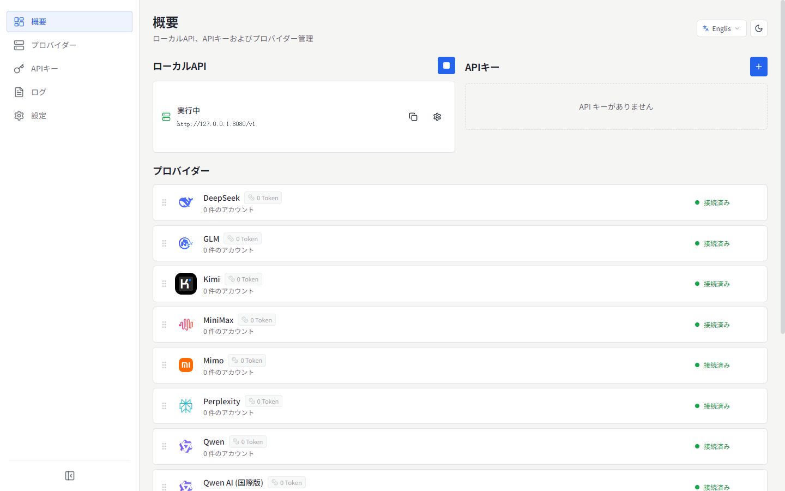
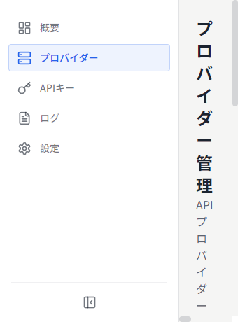
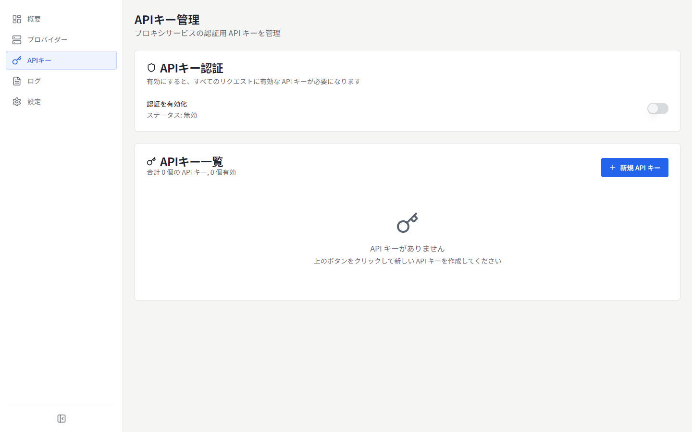
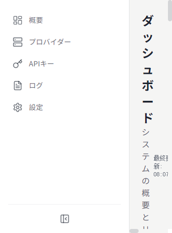
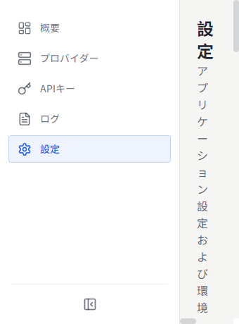

# MyChatBridge

<p align="center">
  
</p>

<p align="center">
  
  
  <br>
  <a href="https://www.electronjs.org/"></a>
  <a href="https://react.dev/"></a>
  <a href="https://www.typescriptlang.org/"></a>
  
</p>

[English](README.md) | [简体中文](README.zh-CN.md) | [繁體中文](README.zh-TW.md) | **日本語** | [한국어](README.ko-KR.md) | [Español](README.es-ES.md) | [Français](README.fr-FR.md) | [Deutsch](README.de-DE.md) | [Русский](README.ru-RU.md)

MyChatBridge は、複数の AI プロバイダーに対して統一管理された OpenAI 互換 API プロキシを提供するクロスプラットフォームデスクトップアプリ（Electron）です。Cline、Roo-Code、Cherry Studio など、OpenAI 互換クライアントですぐに使えます。

## ✨ 特徴

- **OpenAI 互換 API**：標準の OpenAI 互換エンドポイントを提供し、既存ツールにシームレスに統合
- **マルチプロバイダー対応**：DeepSeek、GLM、Kimi、MiniMax、Perplexity、Qwen、Z.ai、ChatGPT Web、Doubao Web など
- **Web LLM アカウント**：3 つの認証方式——管理された Connect ログイン、ブラウザ Cookie のインポート（Windows）、手動トークン
- **コンテキスト管理**：スライディングウィンドウ、トークン制限、要約戦略
- **ツール呼び出し対応**：プロンプトエンジニアリングにより全モデルに汎用ツール呼び出し機能を提供
- **モデルマッピング**：ワイルドカード対応のモデル名マッピング、優先プロバイダー/アカウントのルーティング
- **カスタムパラメータ**：カスタム HTTP ヘッダーでウェブ検索、思考モード、ディープリサーチを有効化
- **ダッシュボード**：リアルタイムのリクエスト流量、トークン使用量、成功率
- **API キー管理**：ローカルプロキシ用キーの生成と管理
- **モデル管理**：プロバイダーごとの利用可能モデルの閲覧と管理
- **リクエストログ**：デバッグと分析に役立つ詳細ログ
- **プロキシ設定**：柔軟なプロキシ設定とルーティングポリシー
- **システムトレイ**：メニューバーから状態に素早くアクセス
- **9 言語の UI**：简体中文、English、繁體中文、日本語、한국어、Español、Français、Deutsch、Русский
- **運用向け UI**：情報密度優先、等幅数字、フラットデザイン

## 📸 スクリーンショット

### オーバービュー


### プロバイダー


### API キー


### ダッシュボード


### 設定


他の言語のスクリーンショットは [`docs/screenshots/`](docs/screenshots) をご覧ください。

## 📥 ダウンロードとインストール

### プリビルドバイナリ (v0.1.0)

| プラットフォーム | ダウンロードリンク | 備考 |
| :--- | :--- | :--- |
| **Windows** | [インストーラー (.exe)](https://github.com/shellxuatgit/mychatbridge/releases/download/v0.1.0/MyChatBridge-0.1.0-x64-setup.exe) <br> [ポータブル版 (.exe)](https://github.com/shellxuatgit/mychatbridge/releases/download/v0.1.0/MyChatBridge-0.1.0-x64-portable.exe) | Windows 10/11 64ビット |
| **macOS** | [ダウンロード (.dmg)](https://github.com/shellxuatgit/mychatbridge/releases/download/v0.1.0/MyChatBridge-0.1.0-mac-universal.dmg) <br> [ダウンロード (.zip)](https://github.com/shellxuatgit/mychatbridge/releases/download/v0.1.0/MyChatBridge-0.1.0-mac-universal.zip) | Apple Silicon & Intel 両対応 |
| **Linux** | [ダウンロード (.AppImage)](https://github.com/shellxuatgit/mychatbridge/releases/download/v0.1.0/MyChatBridge-0.1.0-x64.AppImage) <br> [ダウンロード (.deb)](https://github.com/shellxuatgit/mychatbridge/releases/download/v0.1.0/MyChatBridge-0.1.0-amd64.deb) | Ubuntu / Debian / Fedora など |

すべてのアーティファクトと過去バージョンは [GitHub Releases](https://github.com/shellxuatgit/mychatbridge/releases) をご覧ください。

### ソースからビルド

```bash
git clone https://github.com/shellxuatgit/mychatbridge.git
cd mychatbridge
npm install
npm run build:win    # Windows
npm run build:mac    # macOS
npm run build:linux  # Linux
```

## 🚀 使い方

1. **アプリを起動**——バックグラウンドで動作し、システムトレイアイコンからアクセスできます。
2. **プロバイダーを追加**——*プロバイダー* ページでプロバイダーを選び、アカウントを接続：
   - **Connect（推奨）**：管理された Chromium ウィンドウで公式 Web UI が開きます。通常どおりログインするとセッションが永続化されます。
   - **ブラウザからインポート（Windows）**：Chrome/Edge の既存ログインを再利用。ブラウザデータは変更されません。
   - **手動トークン**：既存のアクセストークンを貼り付けます。
3. **API キーを作成**——*API キー* ページでローカルプロキシ用のキーを生成します。
4. **クライアントを接続**——Cline / Roo-Code / Cherry Studio などで、API アドレスを `http://localhost:<ポート>/v1` に向けて API キーを入力し、マッピングされた任意のモデル名（例：`gpt-4o`、`claude-3-5-sonnet`）を選択します。
5. **モニタリング**——オーバービュー/ダッシュボードでトラフィック、トークン使用量、ログをリアルタイム表示。

> v0.1.0 以降、ツール呼び出しプロトコルタグは `<|MYCHATBRIDGE|tool_calls>` に変更されました。クライアント統合を更新してください。

## ⚙️ 設定

すべてのデータは `~/.mychatbridge/` に保存されます：

| ファイル / フォルダ | 用途 |
| --- | --- |
| `data.json` | アプリ設定、プロバイダー、アカウント |
| `logs/` | リクエストログ |
| `web-runtime/` | Web LLM セッション用の管理ブラウザプロファイル |

表示言語はヘッダーまたは *設定 → 外観* からいつでも変更できます。

## 📄 ライセンス

[GPL-3.0](LICENSE)

## 💬 サポート＆チーム

[MyChatbot チーム](https://MyChatbot.dev) によるサポートとメンテナンス

