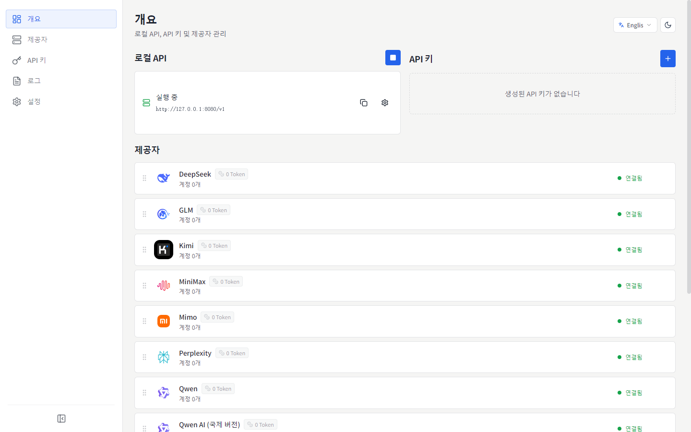
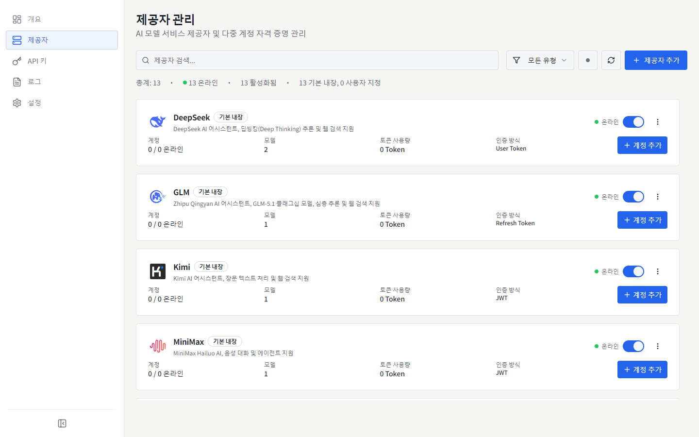
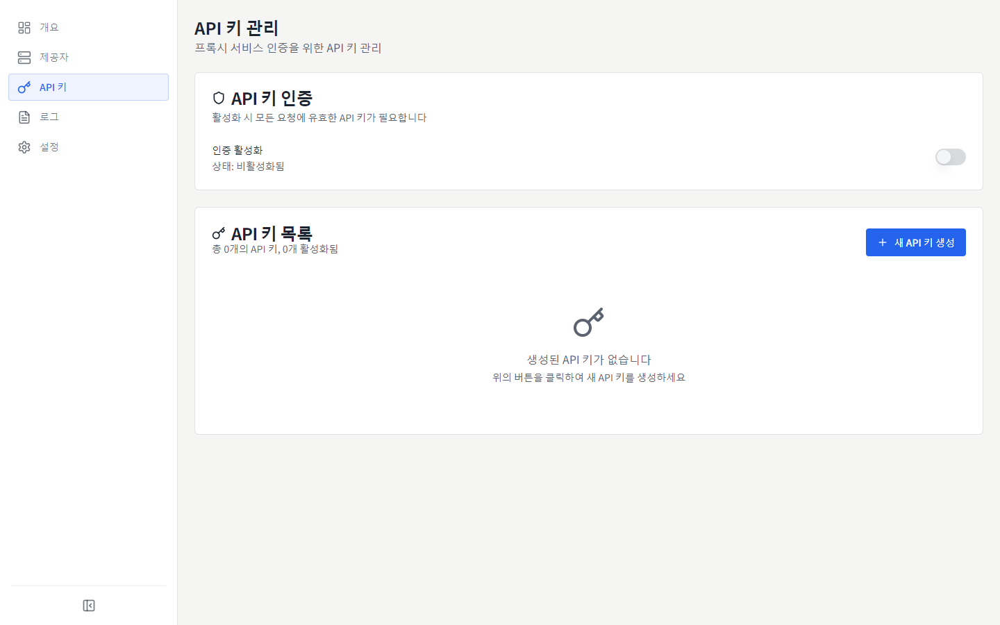
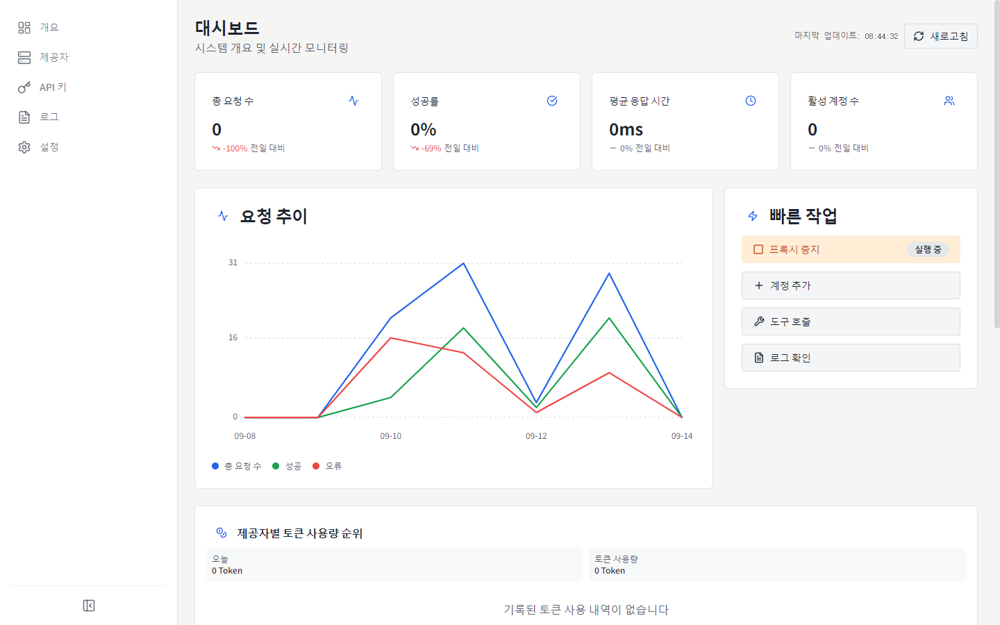
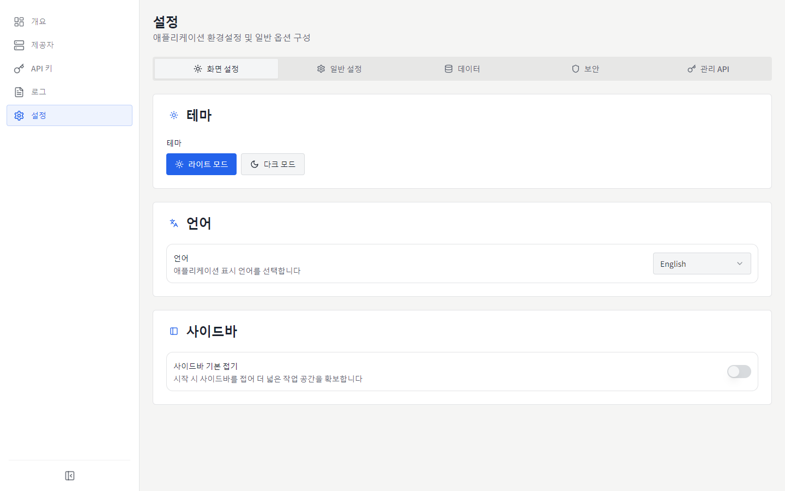

# MyChatBridge

<p align="center">
  
</p>

<p align="center">
  
  
  <br>
  <a href="https://www.electronjs.org/"></a>
  <a href="https://react.dev/"></a>
  <a href="https://www.typescriptlang.org/"></a>
  
</p>

[English](README.md) | [简体中文](README.zh-CN.md) | [繁體中文](README.zh-TW.md) | [日本語](README.ja-JP.md) | **한국어** | [Español](README.es-ES.md) | [Français](README.fr-FR.md) | [Deutsch](README.de-DE.md) | [Русский](README.ru-RU.md)

MyChatBridge는 여러 AI 서비스 제공자를 위한 통합 관리형 OpenAI 호환 API 프록시를 제공하는 크로스 플랫폼 데스크톱 앱(Electron)입니다. Cline, Roo-Code, Cherry Studio 등 OpenAI 호환 클라이언트에서 바로 사용할 수 있습니다.

## ✨ 주요 기능

- **OpenAI 호환 API**: 표준 OpenAI 호환 엔드포인트를 제공하여 기존 도구와 원활하게 통합
- **멀티 프로바이더 지원**: DeepSeek, GLM, Kimi, MiniMax, Perplexity, Qwen, Z.ai, ChatGPT Web, Doubao Web 등
- **Web LLM 계정**: 3가지 인증 방식 — 관리형 Connect 로그인, 브라우저 쿠키 가져오기(Windows), 수동 토큰
- **컨텍스트 관리**: 슬라이딩 윈도우, 토큰 제한, 요약 전략
- **도구 호출 지원**: 프롬프트 엔지니어링을 통해 모든 모델에 범용 도구 호출 기능 제공
- **모델 매핑**: 와일드카드 모델명 매핑, 기본 프로바이더/계정 라우팅
- **사용자 정의 매개변수**: 사용자 정의 HTTP 헤더로 웹 검색, 사고 모드, 딥 리서치 활성화
- **대시보드**: 실시간 요청 트래픽, 토큰 사용량, 성공률
- **API 키 관리**: 로컬 프록시용 키 생성 및 관리
- **모델 관리**: 프로바이더별 사용 가능한 모델 조회 및 관리
- **요청 로그**: 디버깅과 분석에 유용한 상세 로그
- **프록시 설정**: 유연한 프록시 설정 및 라우팅 정책
- **시스템 트레이**: 메뉴 막대에서 상태에 빠르게 접근
- **9개 언어 UI**: 简体中文, English, 繁體中文, 日本語, 한국어, Español, Français, Deutsch, Русский
- **운영용 UI**: 정보 밀도 우선, 고정폭 숫자, 플랫 디자인

## 📸 스크린샷

### 개요


### 프로바이더


### API 키


### 대시보드


### 설정


다른 언어의 스크린샷은 [`docs/screenshots/`](docs/screenshots)에서 확인할 수 있습니다.

## 📥 다운로드 및 설치

### 사전 빌드된 바이너리 (v0.1.0)

| 플랫폼 | 다운로드 링크 | 비고 |
| :--- | :--- | :--- |
| **Windows** | [설치 프로그램 (.exe)](https://github.com/shellxuatgit/mychatbridge/releases/download/v0.1.0/MyChatBridge-0.1.0-x64-setup.exe) <br> [포터블 버전 (.exe)](https://github.com/shellxuatgit/mychatbridge/releases/download/v0.1.0/MyChatBridge-0.1.0-x64-portable.exe) | Windows 10/11 64비트 |
| **macOS** | [다운로드 (.dmg)](https://github.com/shellxuatgit/mychatbridge/releases/download/v0.1.0/MyChatBridge-0.1.0-mac-universal.dmg) <br> [다운로드 (.zip)](https://github.com/shellxuatgit/mychatbridge/releases/download/v0.1.0/MyChatBridge-0.1.0-mac-universal.zip) | Apple Silicon 및 Intel 범용 |
| **Linux** | [다운로드 (.AppImage)](https://github.com/shellxuatgit/mychatbridge/releases/download/v0.1.0/MyChatBridge-0.1.0-x64.AppImage) <br> [다운로드 (.deb)](https://github.com/shellxuatgit/mychatbridge/releases/download/v0.1.0/MyChatBridge-0.1.0-amd64.deb) | Ubuntu / Debian / Fedora 등 |

전체 릴리스 및 이전 버전은 [GitHub Releases](https://github.com/shellxuatgit/mychatbridge/releases)에서 확인하세요.

### 소스에서 빌드

```bash
git clone https://github.com/shellxuatgit/mychatbridge.git
cd mychatbridge
npm install
npm run build:win    # Windows
npm run build:mac    # macOS
npm run build:linux  # Linux
```

## 🚀 사용 방법

1. **앱 실행** — 백그라운드에서 실행되며 시스템 트레이 아이콘으로 접근할 수 있습니다.
2. **프로바이더 추가** — *프로바이더* 페이지에서 서비스를 선택하고 계정을 연결합니다:
   - **Connect(권장)**: 관리형 Chromium 창에서 공식 Web UI가 열립니다. 정상적으로 로그인하면 세션이 자동으로 저장됩니다.
   - **브라우저에서 가져오기(Windows)**: Chrome/Edge의 기존 로그인을 재사용합니다. 브라우저 데이터는 수정되지 않습니다.
   - **수동 토큰**: 기존 액세스 토큰을 붙여넣습니다.
3. **API 키 생성** — *API 키* 페이지에서 로컬 프록시용 키를 생성합니다.
4. **클라이언트 연결** — Cline / Roo-Code / Cherry Studio 등에서 API 주소를 `http://localhost:<포트>/v1`로 지정하고, API 키를 입력한 뒤 매핑된 모델명(예: `gpt-4o`, `claude-3-5-sonnet`)을 선택합니다.
5. **모니터링** — 개요/대시보드에서 트래픽, 토큰 사용량, 로그를 실시간으로 확인합니다.

> v0.1.0부터 도구 호출 프로토콜 태그가 `<|MYCHATBRIDGE|tool_calls>`로 변경되었습니다. 클라이언트 통합을 업데이트하세요.

## ⚙️ 설정

모든 데이터는 `~/.mychatbridge/`에 저장됩니다:

| 파일 / 폴더 | 용도 |
| --- | --- |
| `data.json` | 앱 설정, 프로바이더, 계정 |
| `logs/` | 요청 로그 |
| `web-runtime/` | Web LLM 세션용 관리 브라우저 프로필 |

표시 언어는 상단 바 또는 *설정 → 외관*에서 언제든 변경할 수 있습니다.

## 📄 라이선스

[GPL-3.0](LICENSE)
