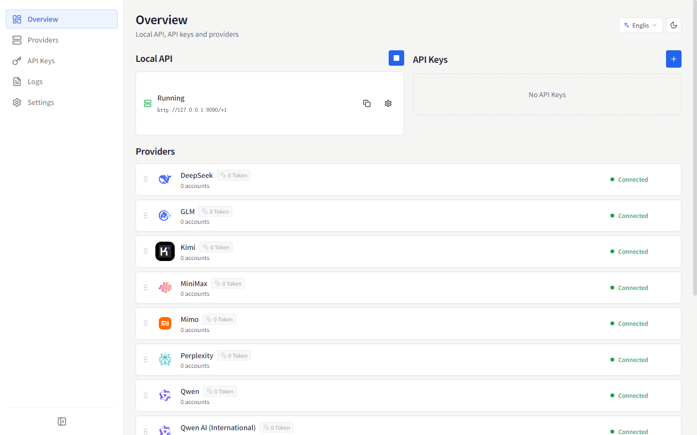
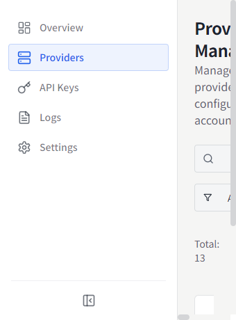
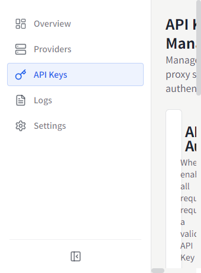
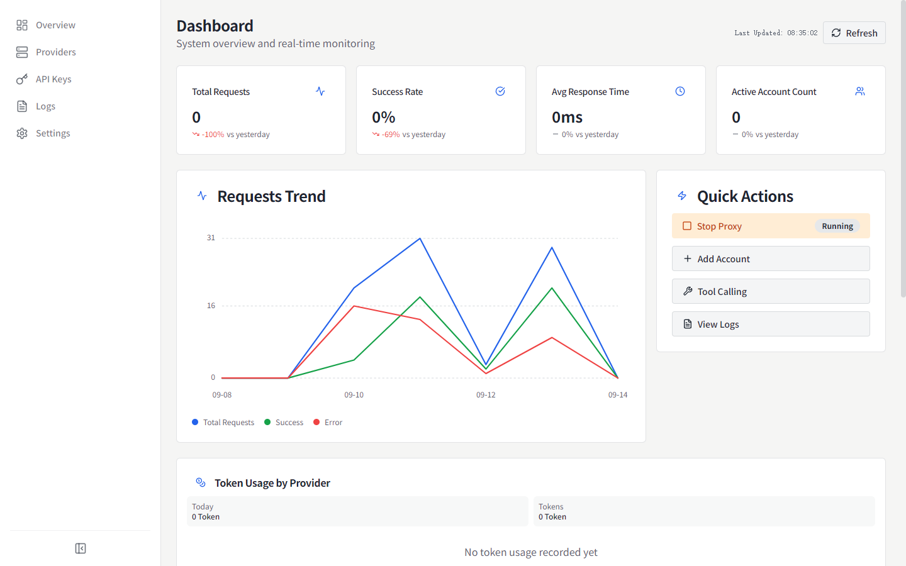
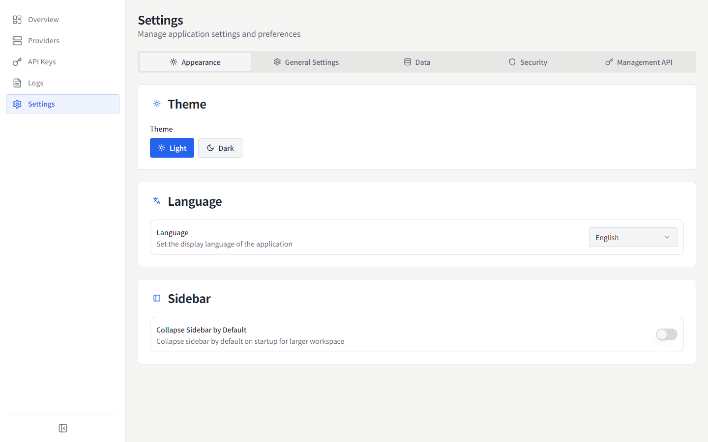

# MyChatBridge

<p align="center">
  
</p>

<p align="center">
  
  
  <br>
  <a href="https://www.electronjs.org/"></a>
  <a href="https://react.dev/"></a>
  <a href="https://www.typescriptlang.org/"></a>
  
</p>

**English** | [简体中文](README.zh-CN.md) | [繁體中文](README.zh-TW.md) | [日本語](README.ja-JP.md) | [한국어](README.ko-KR.md) | [Español](README.es-ES.md) | [Français](README.fr-FR.md) | [Deutsch](README.de-DE.md) | [Русский](README.ru-RU.md)

MyChatBridge is a cross-platform desktop application (Electron) that provides a unified, OpenAI-compatible API proxy for multiple AI providers. It works out of the box with any OpenAI-compatible client such as Cline, Roo-Code, or Cherry Studio.

## ✨ Features

- **OpenAI-compatible API** — a standard endpoint that integrates seamlessly with existing tools
- **Multi-provider support** — DeepSeek, GLM, Kimi, MiniMax, Perplexity, Qwen, Z.ai, ChatGPT Web, Doubao Web, and more
- **Web LLM accounts** — three authentication paths: managed Connect login, browser-cookie import (Windows), or manual token
- **Context management** — sliding window, token limits, and summarization strategies
- **Tool calling** — universal tool-calling capability for all models via prompt engineering
- **Model mapping** — wildcard model-name mapping with preferred provider/account routing
- **Custom parameters** — custom HTTP headers to enable web search, thinking mode, and deep research
- **Dashboard** — real-time request traffic, token usage, and success rate
- **API key management** — generate and manage keys for the local proxy
- **Model management** — view and manage all available models per provider
- **Request logs** — detailed logs for debugging and analysis
- **Proxy configuration** — flexible proxy settings and routing policies
- **System tray** — quick access to status from the menu bar
- **9 UI languages** — 简体中文, English, 繁體中文, 日本語, 한국어, Español, Français, Deutsch, Русский
- **Operations-grade UI** — information-density-first, monospace numerals, flat design

## 📸 Screenshots

### Overview


### Providers


### API Keys


### Dashboard


### Settings


More screenshots in other languages are available under [`docs/screenshots/`](docs/screenshots).

## 📥 Installation & Downloads

### Prebuilt Binaries (v0.1.0)

| Platform | Download Link | Notes |
| :--- | :--- | :--- |
| **Windows** | [Download Setup (.exe)](https://github.com/shellxuatgit/mychatbridge/releases/download/v0.1.0/MyChatBridge-0.1.0-x64-setup.exe) <br> [Download Portable (.exe)](https://github.com/shellxuatgit/mychatbridge/releases/download/v0.1.0/MyChatBridge-0.1.0-x64-portable.exe) | Windows 10/11 64-bit |
| **macOS** | [Download (.dmg)](https://github.com/shellxuatgit/mychatbridge/releases/download/v0.1.0/MyChatBridge-0.1.0-mac-universal.dmg) <br> [Download (.zip)](https://github.com/shellxuatgit/mychatbridge/releases/download/v0.1.0/MyChatBridge-0.1.0-mac-universal.zip) | Apple Silicon & Intel |
| **Linux** | [Download (.AppImage)](https://github.com/shellxuatgit/mychatbridge/releases/download/v0.1.0/MyChatBridge-0.1.0-x64.AppImage) <br> [Download (.deb)](https://github.com/shellxuatgit/mychatbridge/releases/download/v0.1.0/MyChatBridge-0.1.0-amd64.deb) | Ubuntu / Debian / Fedora |

View all artifacts and historical versions on [GitHub Releases](https://github.com/shellxuatgit/mychatbridge/releases).

### Build from source

```bash
git clone https://github.com/shellxuatgit/mychatbridge.git
cd mychatbridge
npm install
npm run build:win    # Windows
npm run build:mac    # macOS
npm run build:linux  # Linux
```

## 🚀 Usage

1. **Launch the app** — it runs in the background with a system tray icon.
2. **Add a provider** — go to *Providers*, pick a provider, and connect an account:
   - **Connect (recommended)**: a managed Chromium window opens the provider's official Web UI; log in normally and the session is persisted.
   - **Import from browser (Windows)**: reuse an existing login from Chrome/Edge without touching your browser data.
   - **Manual token**: paste an existing access token.
3. **Create an API key** — go to *API Keys* and generate a key for the local proxy.
4. **Point your client to the proxy** — use `http://localhost:<port>/v1` with the API key, e.g. in Cline / Roo-Code / Cherry Studio, and pick any mapped model name (e.g. `gpt-4o`, `claude-3-5-sonnet`).
5. **Monitor** — the Overview/Dashboard shows live traffic, token usage, and logs.

> Tool-calling protocol tag since v0.1.0 is `<|MYCHATBRIDGE|tool_calls>`. Update your client integrations accordingly.

## ⚙️ Configuration

All data is stored under `~/.mychatbridge/`:

| File / folder | Purpose |
| --- | --- |
| `data.json` | Application configuration, providers, accounts |
| `logs/` | Request logs |
| `web-runtime/` | Managed browser profiles for Web LLM sessions |

Display language can be changed anytime from the header or *Settings → Appearance*.

## 📄 License

[GPL-3.0](LICENSE)

## 💬 Support & Team

Supported by [MyChatbot Team](https://MyChatbot.dev)

