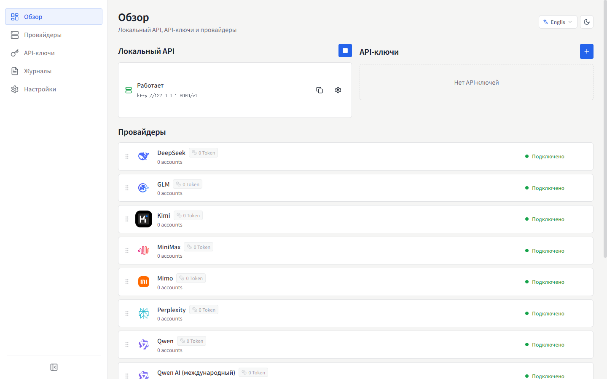
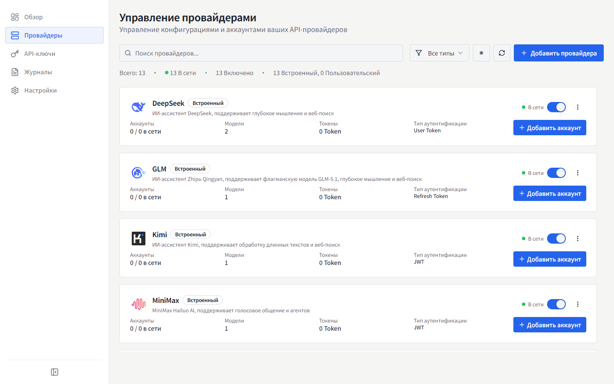
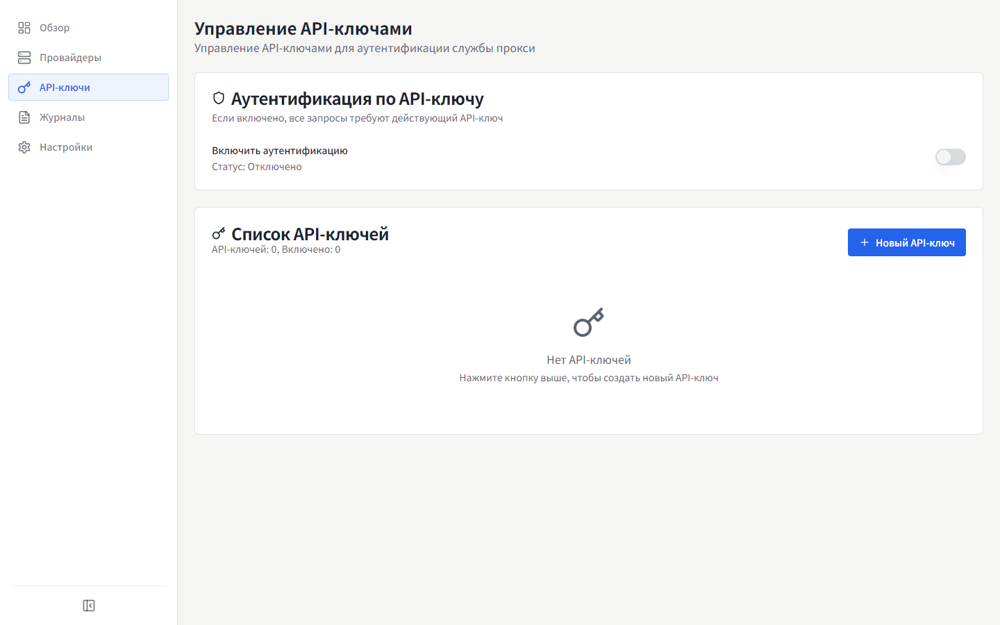
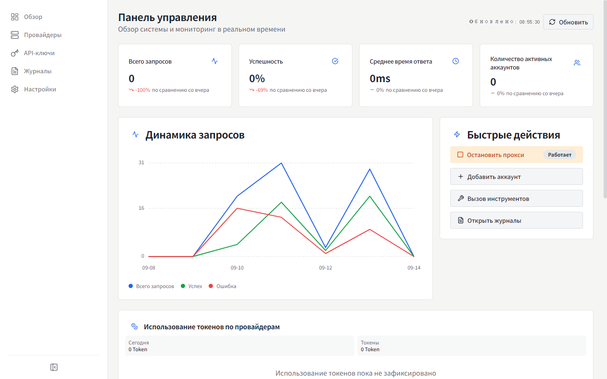
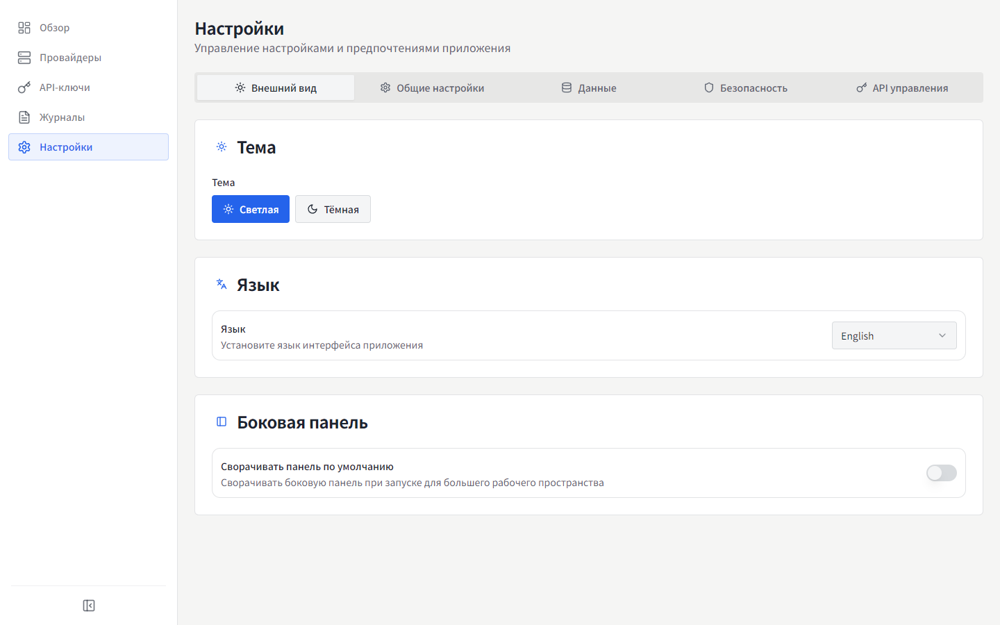

# MyChatBridge

<p align="center">
  
</p>

<p align="center">
  
  
  <br>
  <a href="https://www.electronjs.org/"></a>
  <a href="https://react.dev/"></a>
  <a href="https://www.typescriptlang.org/"></a>
  
</p>

[English](README.md) | [简体中文](README.zh-CN.md) | [繁體中文](README.zh-TW.md) | [日本語](README.ja-JP.md) | [한국어](README.ko-KR.md) | [Español](README.es-ES.md) | [Français](README.fr-FR.md) | [Deutsch](README.de-DE.md) | **Русский** |

MyChatBridge — это кроссплатформенное настольное приложение (Electron), предоставляющее единый OpenAI-совместимый API-прокси для нескольких ИИ-провайдеров. Работает «из коробки» с любым OpenAI-совместимым клиентом, таким как Cline, Roo-Code или Cherry Studio.

## ✨ Возможности

- **OpenAI-совместимый API** — стандартная конечная точка, бесшовно интегрируется с существующими инструментами
- **Поддержка нескольких провайдеров** — DeepSeek, GLM, Kimi, MiniMax, Perplexity, Qwen, Z.ai, ChatGPT Web, Doubao Web и другие
- **Аккаунты Web LLM** — три способа аутентификации: управляемый вход Connect, импорт cookie из браузера (Windows) или ручной токен
- **Управление контекстом** — скользящее окно, лимиты токенов, стратегии суммаризации
- **Вызов инструментов** — универсальная поддержка tool calling для всех моделей через prompt engineering
- **Маппинг моделей** — маппинг имён моделей с подстановочными знаками, маршрутизация через предпочтительный провайдер/аккаунт
- **Пользовательские параметры** — пользовательские HTTP-заголовки для включения веб-поиска, режима размышления и глубокого исследования
- **Панель мониторинга** — трафик запросов, использование токенов и процент успеха в реальном времени
- **Управление API-ключами** — генерация и управление ключами локального прокси
- **Управление моделями** — просмотр всех доступных моделей каждого провайдера
- **Журналы запросов** — подробные логи для отладки и анализа
- **Настройка прокси** — гибкие настройки прокси и политики маршрутизации
- **Системный трей** — быстрый доступ к статусу из панели меню
- **9 языков интерфейса**: 简体中文, English, 繁體中文, 日本語, 한국어, Español, Français, Deutsch, Русский
- **Интерфейс для эксплуатации** — приоритет информационной плотности, моноширинные числа, плоский дизайн

## 📸 Скриншоты

### Обзор


### Провайдеры


### API-ключи


### Панель мониторинга


### Настройки


Скриншоты на других языках доступны в каталоге [`docs/screenshots/`](docs/screenshots).

## 📥 Загрузки и установка

### Готовые сборки (v0.1.0)

| Платформа | Ссылка на скачивание | Примечания |
| :--- | :--- | :--- |
| **Windows** | [Скачать Установщик (.exe)](https://github.com/shellxuatgit/mychatbridge/releases/download/v0.1.0/MyChatBridge-0.1.0-x64-setup.exe) <br> [Скачать Портативную версию (.exe)](https://github.com/shellxuatgit/mychatbridge/releases/download/v0.1.0/MyChatBridge-0.1.0-x64-portable.exe) | Windows 10/11 64-бит |
| **macOS** | [Скачать (.dmg)](https://github.com/shellxuatgit/mychatbridge/releases/download/v0.1.0/MyChatBridge-0.1.0-mac-universal.dmg) <br> [Скачать (.zip)](https://github.com/shellxuatgit/mychatbridge/releases/download/v0.1.0/MyChatBridge-0.1.0-mac-universal.zip) | Apple Silicon и Intel |
| **Linux** | [Скачать (.AppImage)](https://github.com/shellxuatgit/mychatbridge/releases/download/v0.1.0/MyChatBridge-0.1.0-x64.AppImage) <br> [Скачать (.deb)](https://github.com/shellxuatgit/mychatbridge/releases/download/v0.1.0/MyChatBridge-0.1.0-amd64.deb) | Ubuntu / Debian / Fedora |

Все релизы и файлы доступны на странице [GitHub Releases](https://github.com/shellxuatgit/mychatbridge/releases).

### Сборка из исходников

```bash
git clone https://github.com/shellxuatgit/mychatbridge.git
cd mychatbridge
npm install
npm run build:win    # Windows
npm run build:mac    # macOS
npm run build:linux  # Linux
```

## 🚀 Использование

1. **Запустите приложение** — оно работает в фоне со значком в системном трее.
2. **Добавьте провайдера** — перейдите в раздел *Провайдеры*, выберите сервис и подключите аккаунт:
   - **Connect (рекомендуется)**: управляемое окно Chromium открывает официальный веб-интерфейс провайдера; войдите как обычно — сессия сохранится.
   - **Импорт из браузера (Windows)**: используйте существующий вход в Chrome/Edge без изменения данных браузера.
   - **Ручной токен**: вставьте существующий access token.
3. **Создайте API-ключ** — в разделе *API-ключи* сгенерируйте ключ для локального прокси.
4. **Настройте клиент** — укажите в Cline / Roo-Code / Cherry Studio адрес `http://localhost:<порт>/v1` с API-ключом и выберите любое смаппенное имя модели (например, `gpt-4o`, `claude-3-5-sonnet`).
5. **Мониторинг** — на обзорной панели отображаются трафик, использование токенов и логи в реальном времени.

> Метка протокола tool calling начиная с v0.1.0 — `<|MYCHATBRIDGE|tool_calls>`. Обновите интеграции клиента соответственно.

## ⚙️ Конфигурация

Все данные хранятся в `~/.mychatbridge/`:

| Файл / папка | Назначение |
| --- | --- |
| `data.json` | Конфигурация приложения, провайдеры, аккаунты |
| `logs/` | Журналы запросов |
| `web-runtime/` | Управляемые профили браузера для Web LLM сессий |

Язык интерфейса можно изменить в любой момент в шапке приложения или в *Настройки → Внешний вид*.

## 📄 Лицензия

[GPL-3.0](LICENSE)
