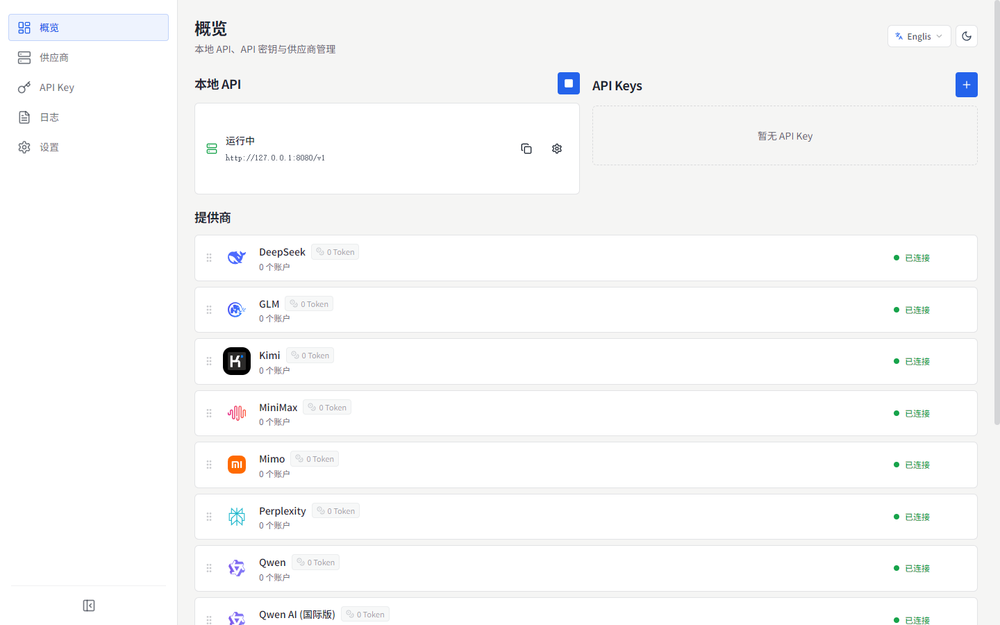
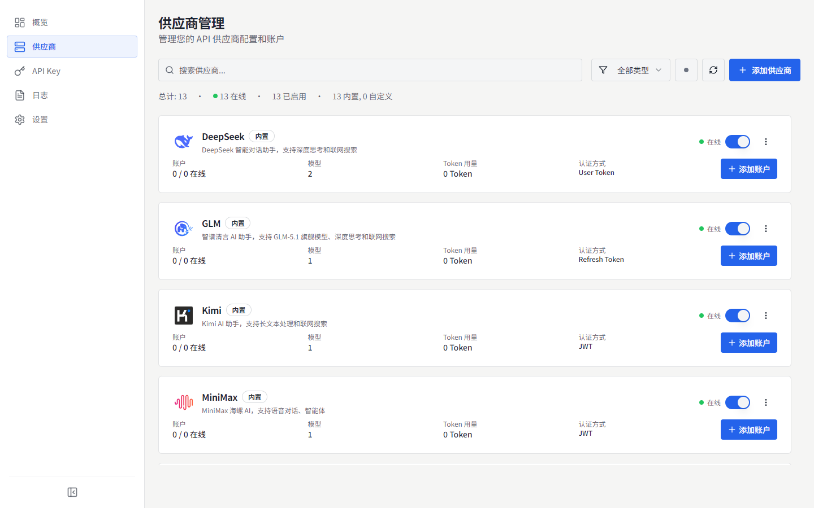
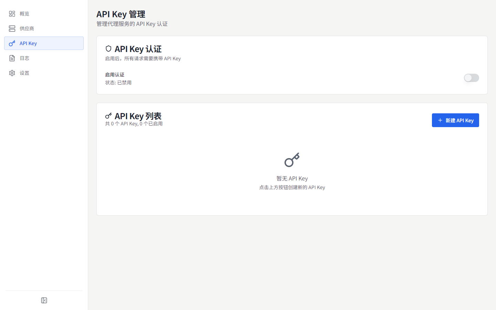
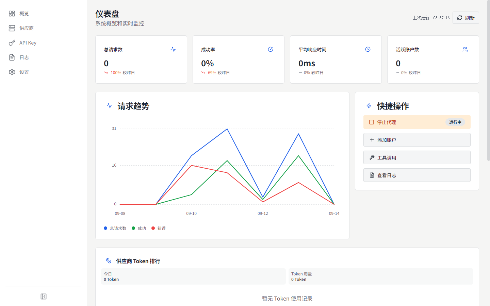
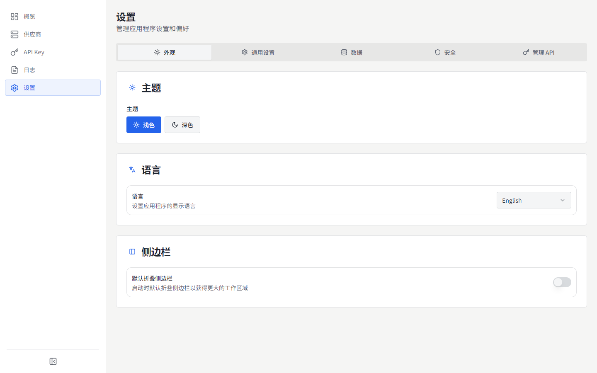

# MyChatBridge

<p align="center">
  
</p>

<p align="center">
  
  
  <br>
  <a href="https://www.electronjs.org/"></a>
  <a href="https://react.dev/"></a>
  <a href="https://www.typescriptlang.org/"></a>
  
</p>

[English](README.md) | **简体中文** | [繁體中文](README.zh-TW.md) | [日本語](README.ja-JP.md) | [한국어](README.ko-KR.md) | [Español](README.es-ES.md) | [Français](README.fr-FR.md) | [Deutsch](README.de-DE.md) | [Русский](README.ru-RU.md)

MyChatBridge 是一款跨平台桌面应用（Electron），为多个 AI 服务提供商提供统一管理的 OpenAI 兼容 API 代理。可与 Cline、Roo-Code、Cherry Studio 等任意 OpenAI 兼容客户端开箱即用。

## ✨ 特性

- **OpenAI 兼容 API**：提供标准 OpenAI 兼容端点，与现有工具无缝集成
- **多 Provider 支持**：DeepSeek、GLM、Kimi、MiniMax、Perplexity、Qwen、Z.ai、ChatGPT Web、豆包 Web 等
- **Web LLM 账户**：三种认证方式——受管 Connect 登录、浏览器 Cookie 导入（Windows）、手动 Token
- **上下文管理**：滑动窗口、Token 限制、摘要策略
- **工具调用支持**：通过提示工程为所有模型提供通用工具调用能力
- **模型映射**：通配符模型名映射，支持首选 Provider/账号
- **自定义参数**：自定义 HTTP 头以启用联网搜索、思考模式、深度研究
- **仪表盘监控**：实时请求流量、Token 使用、成功率
- **API Key 管理**：为本地代理生成与管理密钥
- **模型管理**：查看与管理所有 Provider 可用模型
- **请求日志**：详细请求日志，便于调试与分析
- **代理配置**：灵活的代理设置与路由策略
- **系统托盘**：菜单栏快速访问状态
- **9 种界面语言**：简体中文、English、繁體中文、日本語、한국어、Español、Français、Deutsch、Русский
- **专业运维界面**：信息密度优先，等宽数值，扁平直边

## 📸 截图

### 总览


### 供应商


### API Key


### 仪表盘


### 设置


更多语言的截图见 [`docs/screenshots/`](docs/screenshots)。

## 📥 下载与安装

### 预编译安装包 (v0.1.0)

| 平台 | 下载链接 | 说明 |
| :--- | :--- | :--- |
| **Windows** | [下载 安装版 (.exe)](https://github.com/shellxuatgit/mychatbridge/releases/download/v0.1.0/MyChatBridge-0.1.0-x64-setup.exe) <br> [下载 便携版 (.exe)](https://github.com/shellxuatgit/mychatbridge/releases/download/v0.1.0/MyChatBridge-0.1.0-x64-portable.exe) | Windows 10/11 64位 |
| **macOS** | [下载 (.dmg)](https://github.com/shellxuatgit/mychatbridge/releases/download/v0.1.0/MyChatBridge-0.1.0-mac-universal.dmg) <br> [下载 (.zip)](https://github.com/shellxuatgit/mychatbridge/releases/download/v0.1.0/MyChatBridge-0.1.0-mac-universal.zip) | Apple Silicon 与 Intel 通用 |
| **Linux** | [下载 (.AppImage)](https://github.com/shellxuatgit/mychatbridge/releases/download/v0.1.0/MyChatBridge-0.1.0-x64.AppImage) <br> [下载 (.deb)](https://github.com/shellxuatgit/mychatbridge/releases/download/v0.1.0/MyChatBridge-0.1.0-amd64.deb) | Ubuntu / Debian / Fedora 等 |

更多历史版本与产物请前往 [GitHub Releases](https://github.com/shellxuatgit/mychatbridge/releases)。

### 从源码构建

```bash
git clone https://github.com/shellxuatgit/mychatbridge.git
cd mychatbridge
npm install
npm run build:win    # Windows
npm run build:mac    # macOS
npm run build:linux  # Linux
```

## 🚀 使用说明

1. **启动应用**——应用在后台运行，可通过系统托盘图标访问。
2. **添加供应商**——进入 *供应商* 页面，选择服务商并连接账号：
   - **Connect（推荐）**：应用会启动独立的受管 Chromium 窗口打开官方 Web UI，正常登录后 session 自动持久化。
   - **从浏览器导入（Windows）**：复用 Chrome/Edge 已有登录态，不修改浏览器数据。
   - **手动 Token**：粘贴已有的 access token。
3. **创建 API Key**——进入 *API Key* 页面，为本地代理生成密钥。
4. **接入客户端**——在 Cline / Roo-Code / Cherry Studio 等客户端中，将 API 地址指向 `http://localhost:<端口>/v1`，填入 API Key，选择任意映射的模型名（如 `gpt-4o`、`claude-3-5-sonnet`）。
5. **监控**——总览/仪表盘页面实时展示流量、Token 用量与日志。

> 自 v0.1.0 起，工具调用协议标记变更为 `<|MYCHATBRIDGE|tool_calls>`，请同步更新客户端集成。

## ⚙️ 配置

所有数据保存在 `~/.mychatbridge/`：

| 文件 / 目录 | 用途 |
| --- | --- |
| `data.json` | 应用配置、供应商、账号 |
| `logs/` | 请求日志 |
| `web-runtime/` | Web LLM 会话的受管浏览器配置 |

界面语言可随时在顶栏或 *设置 → 外观* 中切换。

## 📄 许可证

[GPL-3.0](LICENSE)
