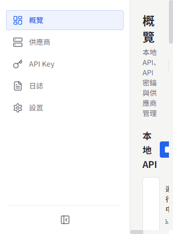
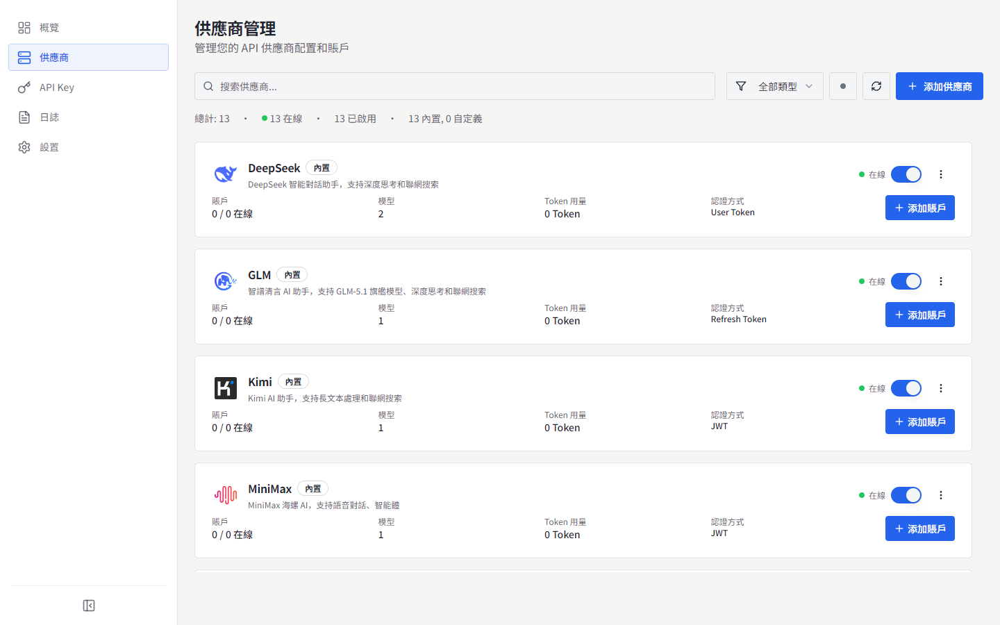
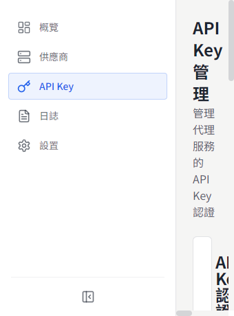
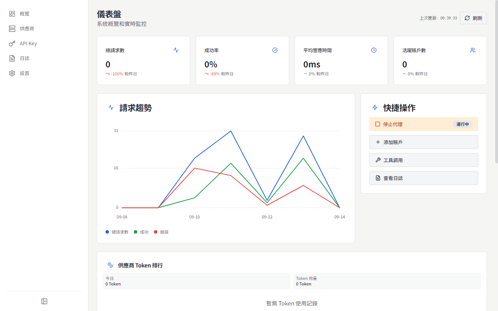
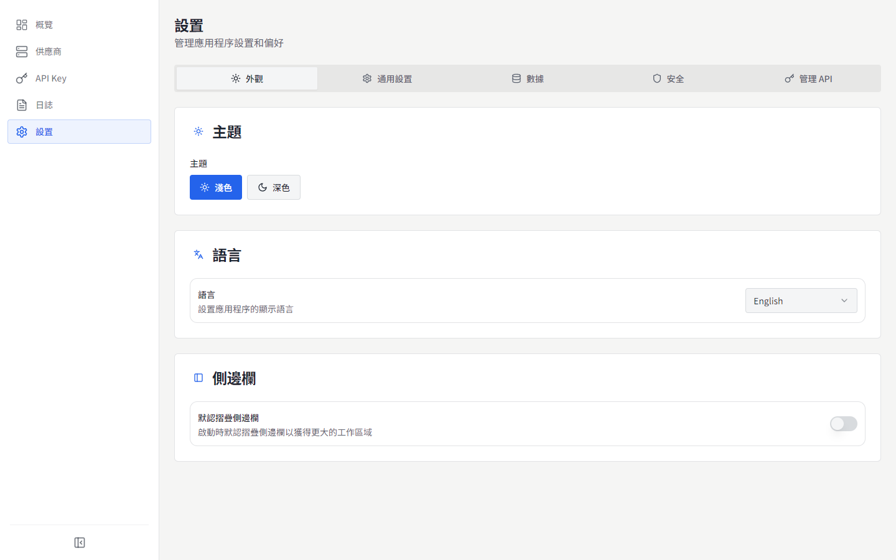

# MyChatBridge

<p align="center">
  
</p>

<p align="center">
  
  
  <br>
  <a href="https://www.electronjs.org/"></a>
  <a href="https://react.dev/"></a>
  <a href="https://www.typescriptlang.org/"></a>
  
</p>

[English](README.md) | [简体中文](README.zh-CN.md) | **繁體中文** | [日本語](README.ja-JP.md) | [한국어](README.ko-KR.md) | [Español](README.es-ES.md) | [Français](README.fr-FR.md) | [Deutsch](README.de-DE.md) | [Русский](README.ru-RU.md)

MyChatBridge 是一款跨平台桌面應用程式（Electron），為多個 AI 服務提供商提供統一管理的 OpenAI 相容 API 代理。可與 Cline、Roo-Code、Cherry Studio 等任意 OpenAI 相容用戶端開箱即用。

## ✨ 特性

- **OpenAI 相容 API**：提供標準 OpenAI 相容端點，與現有工具無縫整合
- **多 Provider 支援**：DeepSeek、GLM、Kimi、MiniMax、Perplexity、Qwen、Z.ai、ChatGPT Web、豆包 Web 等
- **Web LLM 帳戶**：三種認證方式——受管 Connect 登入、瀏覽器 Cookie 匯入（Windows）、手動 Token
- **上下文管理**：滑動視窗、Token 限制、摘要策略
- **工具呼叫支援**：透過提示工程為所有模型提供通用工具呼叫能力
- **模型映射**：萬用字元模型名映射，支援首選 Provider/帳號
- **自訂參數**：自訂 HTTP 標頭以啟用聯網搜尋、思考模式、深度研究
- **儀表板監控**：即時請求流量、Token 使用、成功率
- **API Key 管理**：為本機代理產生與管理金鑰
- **模型管理**：檢視與管理所有 Provider 可用模型
- **請求日誌**：詳細請求日誌，便於除錯與分析
- **代理設定**：靈活的代理設定與路由策略
- **系統匣**：選單列快速存取狀態
- **9 種介面語言**：簡體中文、English、繁體中文、日本語、한국어、Español、Français、Deutsch、Русский
- **專業維運介面**：資訊密度優先，等寬數值，扁平直邊

## 📸 截圖

### 總覽


### 供應商


### API Key


### 儀表板


### 設定


更多語言的截圖見 [`docs/screenshots/`](docs/screenshots)。

## 📥 下載與安裝

### 預編譯安裝包 (v0.1.0)

| 平台 | 下載連結 | 說明 |
| :--- | :--- | :--- |
| **Windows** | [下載 安裝版 (.exe)](https://github.com/shellxuatgit/mychatbridge/releases/download/v0.1.0/MyChatBridge-0.1.0-x64-setup.exe) <br> [下載 便攜版 (.exe)](https://github.com/shellxuatgit/mychatbridge/releases/download/v0.1.0/MyChatBridge-0.1.0-x64-portable.exe) | Windows 10/11 64位元 |
| **macOS** | [下載 (.dmg)](https://github.com/shellxuatgit/mychatbridge/releases/download/v0.1.0/MyChatBridge-0.1.0-mac-universal.dmg) <br> [下載 (.zip)](https://github.com/shellxuatgit/mychatbridge/releases/download/v0.1.0/MyChatBridge-0.1.0-mac-universal.zip) | Apple Silicon 與 Intel 通用 |
| **Linux** | [下載 (.AppImage)](https://github.com/shellxuatgit/mychatbridge/releases/download/v0.1.0/MyChatBridge-0.1.0-x64.AppImage) <br> [下載 (.deb)](https://github.com/shellxuatgit/mychatbridge/releases/download/v0.1.0/MyChatBridge-0.1.0-amd64.deb) | Ubuntu / Debian / Fedora 等 |

更多歷史版本與產物請前往 [GitHub Releases](https://github.com/shellxuatgit/mychatbridge/releases)。

### 從原始碼建置

```bash
git clone https://github.com/shellxuatgit/mychatbridge.git
cd mychatbridge
npm install
npm run build:win    # Windows
npm run build:mac    # macOS
npm run build:linux  # Linux
```

## 🚀 使用說明

1. **啟動應用程式**——應用程式在背景執行，可透過系統匣圖示存取。
2. **新增供應商**——進入 *供應商* 頁面，選擇服務商並連接帳號：
   - **Connect（推薦）**：應用程式會啟動獨立的受管 Chromium 視窗開啟官方 Web UI，正常登入後 session 自動持久化。
   - **從瀏覽器匯入（Windows）**：重複使用 Chrome/Edge 已有登入態，不修改瀏覽器資料。
   - **手動 Token**：貼上已有的 access token。
3. **建立 API Key**——進入 *API Key* 頁面，為本機代理產生金鑰。
4. **接入用戶端**——在 Cline / Roo-Code / Cherry Studio 等用戶端中，將 API 位址指向 `http://localhost:<連接埠>/v1`，填入 API Key，選擇任意映射的模型名稱（如 `gpt-4o`、`claude-3-5-sonnet`）。
5. **監控**——總覽/儀表板頁面即時顯示流量、Token 用量與日誌。

> 自 v0.1.0 起，工具呼叫協定標記變更為 `<|MYCHATBRIDGE|tool_calls>`，請同步更新用戶端整合。

## ⚙️ 設定

所有資料儲存在 `~/.mychatbridge/`：

| 檔案 / 目錄 | 用途 |
| --- | --- |
| `data.json` | 應用程式設定、供應商、帳號 |
| `logs/` | 請求日誌 |
| `web-runtime/` | Web LLM 工作階段的受管瀏覽器設定 |

介面語言可隨時在頂欄或 *設定 → 外觀* 中切換。

## 📄 授權條款

[GPL-3.0](LICENSE)

## 💬 支援與團隊

由 [MyChatbot 團隊](https://MyChatbot.dev) 支援與維護

